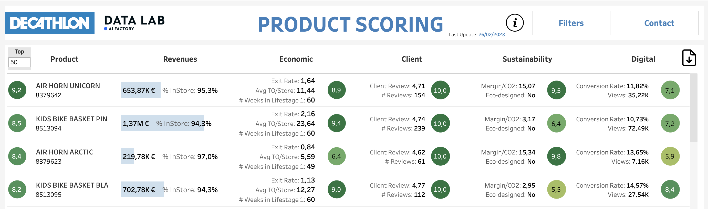
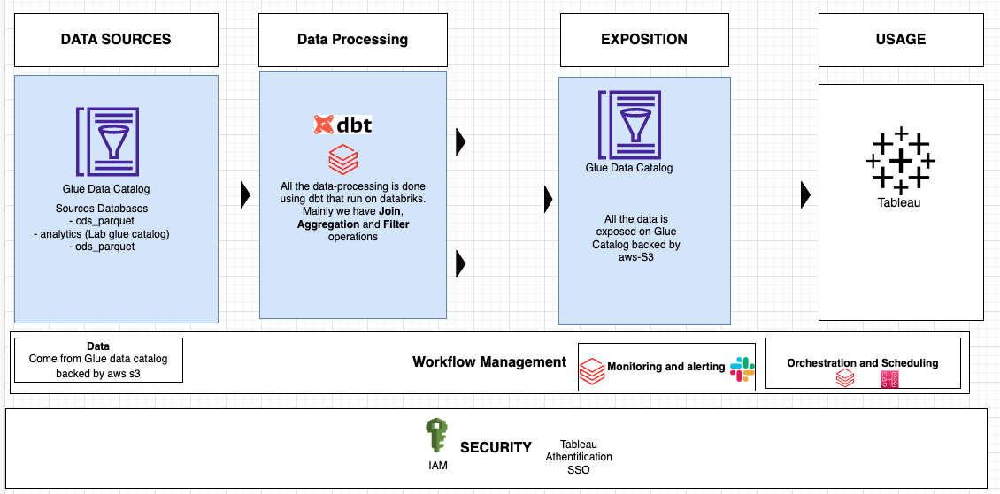
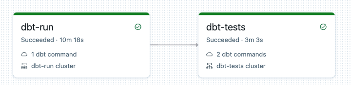
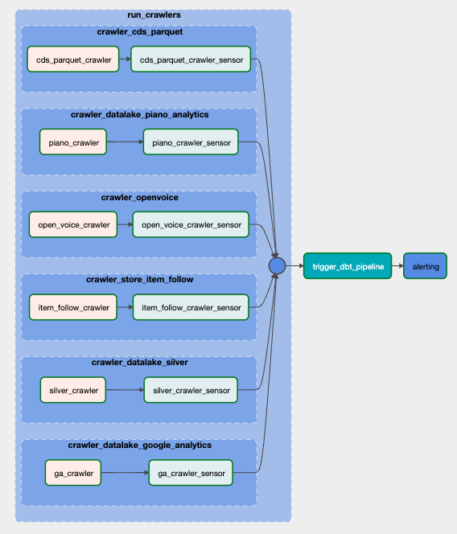
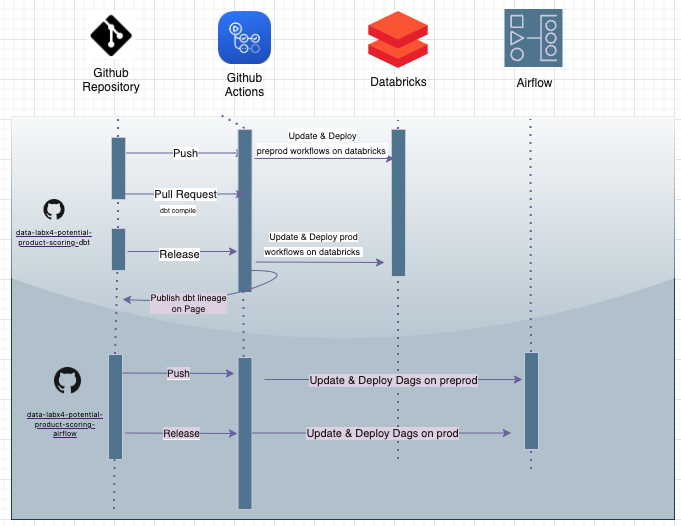

# Potential Product Scoring Dashboard 

|                              Company                               |                              Team                               |                                                  Github                                                  |
| :----------------------------------------------------------------: | :-------------------------------------------------------------: | :------------------------------------------------------------------------------------------------------: |
| [ ]() | []() | [](https://github.com/dktunited/data-labx4-potential-product-scoring-dbt) |

# Table of content (ToC)

- [Potential Product Scoring](#potential-product-scoring)
- [Table of Content (ToC)](#table-of-content-toc)
   - [🎯 Objectives of MyProject](#-objectives-of-myproject)
   - [🔗 Prerequisites](#-prerequisites)
   - [📝  Documentation](#documentation)
   - [Data Solution](#data-solution)
   - [🛠  Implementation](#implementation)
      - [Data Processing](#data-processing)
        - [Data Collect schema](#data-collect-schema)
        - [Data Output schema](#data-output-schema)
        - [Exposition](#exposition)
    - [Solution Architecture](#solution-architecture)
- [🏗️ Project Architecture](#️-project-architecture)
- [⚡️ Quickstart](#⚡️-quickstart)
  - [Setup your environment](#setup-your-environment)
  - [DBT Helper](#dbt-helper)
- [🛠 Developement workflow](#-developement-workflow)
  - [Version management](#version-management)
  - [Setup CICD](#setup-cicd)
  - [Data collect, processing and analysis using dbt](#data-collect-processing-and-analysis-using-dbt)


## See Also

- [Potential Product Scoring Dashboard - Airflow](https://github.com/dktunited/data-labx4-potential-product-scoring-airflow)

# 🎯 Objectives of Potential Product Scoring Dashboard 

**Potential Product Scoring Dashboard** is BI solution on a whole data processing workflow which aims to support the efficiency of the offer and decision-making and better align investement and value cretion to conquer the markets. 

The project was developped by **AI-Lab** at Decathlon United.

**WHY**: 

How are the products in my offer performing ?

Do I necessarily have to renew this model ?

On which strategic areas should I focus my efforts to improve the efficiency of my offer ?

On which products i need to invest my ressources ? 

Here are some examples of crucial questions that Product Managers and Sports Leaders ask themselves regularly. Until now, product managers (CDP) strongly lacked data-centric to monitor the overall performance of their products and take informed decisions of whether to stop, renew or keep producing/suplying them. It is currently up to product managers to manually parse widely spread and unstructred data sources (e.g google sheets) and to identify potentially rellevant information on their own.This painful process is prone to oversights and misinterpretations, and it is also highly time-consuming. In the end, product managers may lose sight of the "big picture" and take unsuitable or inconsistent decisions.

 Consequently, the product managers would like to have in a first place an analytical solution that provides an easy reading of the product offer with a cross-data between the RS and CDP, in order to:
  * identify the products to keep, improve, remove and rethink.
  * Prioritize product managers investments on projects.
  * Refine the choices offered in selection.
  * Adjust selection based on local performance.
  * Adjust/rebalance offers based on performance achieved.
  * Supporting ZDs in the choice of sustainable and efficient offers

Which will enable Decathlon to streamiline oofers as part of DECATHLON new reorgabnisations: 
* The target of -15% of SM selected in 2024 / 2021
* The target of -20% Models selected in 2024/2021
* Optimize 28% of Refs 3% of CA

**WHAT**: The **Potential Product Scoring** solution is based on several kpis such as economic criteria, custumer reviews, environmental impact and digital conveersion rate.

# 🔗 Prerequisites

**A major point** of this project is that it is executed on the **DataBricks AI-Lab account**. 

The data is collected directly from **AWS Glue backed by S3 (datalab account)** using dbt (Data Built Tool) and deployed on **Databricks**.

Finally , the scheduling is done using [Airflow](https://github.com/dktunited/data-labx4-potential-product-scoring-airflow)


# 📝  Documentation

`.github/workflows/on-release.yml` automatically generates the [data lineagen](https://refactored-adventure-k66m8yq.pages.github.io/#!/overview) from CI/CD Github-Actions when a new release is done. 

# Data Solution 

The score is based on multiple KPIs: 

  * Economic: 
    - Exit rate (Taux de sortie): Ratio between the quantity sold and the number of stores seeling the product divided by the number of weeks the product is in lifestage 1.
    - Avg TO/Store (Chiffre d'affaire à la case): Ratio between product physical turnover and number of stores selling the product divided by the number of weeks in lifesatge 1. 
  * Client: Customer review: The average customer product review (When several countries are selected, we display the weighted average).
  * Sustainability: Ratio between the (Digital + Offline) product margin and global CO2 product impact.
  * Digital: Conversion rate ==> ratio between the number of conversions on the site (or transactions) and the total number of unique visitors, over a given period.

  The first step consist on converting all the KPIs into a score between [0:10] that depends on the selection of products that the product manager want to compare/studie, the conversion is based on a percentile calculation (Any of the values in a series dividing the distribution in the series into one hundred groups of equal frequency).

  The last step calculates the overall product score using the score of each KPI with the following formula: 

* **Global Score** = 
  - 30% of the **Economic Score** 
  - 30% of the **Client Score** 
  - 30% of the **Sustainability Score**
  - 10% of the **Digital Score** 

<p align="center">

</p>

# 🛠  Implementation

## Data sources 

Data come from usal S3 DataLake. Glue metastore has been implemented to request easier data. For a better experience with data, feel free to check the [DBT Script](https://github.com/dktunited/data-labx4-potential-product-scoring-dbt/tree/main/models)

## Data Processing 

Here are the following data sources we use so far, along with the cleaning rules: 

| Input Data Type  | Data source | Business rules | 
| :--------------: | :------------------ | :---------- |
| Transaction data | AI Lab Glue: `cds_parquet.f_transaction_detail`, `cds_parquet.f_delivery_detail` | - Digitla/Online transactions are collected from `cds_parquet.f_delivery_detail` with removing the transaction comming from DigitalInStore - Offline transactions are collected from `cds_parquet.f_transaction_detail` and `cds_parquet.f_delivery_detail` to extract transactions related to the DigitalInStore channel - We use the currency exchnage to euro to convert the turnover and margin from local currency into euro|
| Currency exchange data | AI Lab : `cds_parquet.mtf_exchange_rate`, `cds_parquet.d_currency` | We two conditions to get the conversion rate from any local currency to euro `rate_type = 'CLO'` and `to_currency = 'EUR'` |
| Web traffic data | AI Lab Glue: `analytics.ga_sessions`, `analytics.piano_analytics` | We collect data regarding web product page views (`action_type = 2` for `analytics.ga_sessions`, `event_name = 'product.page_display'` for `analytics.piano_analytics`) and web purchases ( `action_type = 6 AND transactionID IS NOT NULL` for `analytics.ga_sessions`, `event_name = 'product.purchased'` for `analytics.piano_analytics`) |
| Customers review data | AI Lab Glue: `ods_parquet.opv_review__review`, `ods_parquet.opv_catalog__product` | We collect the customers reviews only during the last 365 days for every country |
| Item follow by store data | AI Lab Glue: `silver.store_item_follow`, `cds_parquet.d_day`, `cds_parquet.d_business_unit`, `cds_parquet.d_sku` | No rules |
| Lifestage data | AI Lab Glue: `cds_parquet.d_sales_data_material_h`, `cds_parquet.sales_organizations_texts` | We select only the channel distribution number 2 and `PRT` sap source: `distrib_channel = '02'` AND  `sap_source = 'PRT'` |
| Enviromental data | AI Lab Glue: `cds_parquet.f_product_impact_detailled`, `cds_parquet.d_country` | The product CO2 impact don't depend on the country and to have the most complete data we collect the French product CO2 impact `cnt_country_code_3a='FRA'` |
| DMI hierarchical data | AI Lab Glue: `cds_parquet.d_sku`, `cds_parquert.d_sku_h`, `cds_parquet.d_hierarchy_supply` | To get the DMI tree strcuture we need to select the family organization number one `org_fa=1` |

There are three steps in the Data processing (All in dbt):

| Clean Dataset Name | Input Dataset(s) | Data Cleaning Tools/Scripts | 
| :--------------: | :------------------ | :---------- |
| Raw | AI Lab Glue | [SQL Query](https://github.com/dktunited/data-labx4-potential-product-scoring-dbt/tree/main/models/raw) |
| Intermediate | Raw | [SQL Query](https://github.com/dktunited/data-labx4-potential-product-scoring-dbt/tree/main/models/intermediate) | 
| Expose | Intermediate | [SQL Query](https://github.com/dktunited/data-labx4-potential-product-scoring-dbt/tree/main/models/expose/f_dashboard_dataset) | 


### Data Collect (Raw) schema
* Offline transactions per country:

| Column | Type | Comments | 
| :--------------: | :------------------ | :---------- |
| week_id | string | Week number `YYYYWW` |
| day_week_start | date | first day of the week |
| cnt_country_code | string | country code |
| cur_idr_currency | bigint | Currency ID |
| cur_code_currency | string | Currency Code |
| dsm_code | string | Super model code |
| mld_num_model_r3 | bigint | Model code R3 |
| r3_unit_price | decimal(38,14) | Product unit price |
| ca_offline | decimal(38,6) | Offline turnover |
| qty_item_offline | bigint | The number of products sold offline |
| margin_estimate_oflline | decimal(38,6) | Offline margin |
| exchange_rate | decimal(38,32) | exchange rate to euro |

* Digital transactions per country:

| Column | Type | Comments | 
| :--------------: | :------------------ | :---------- | 
| week_id | string | Week number `YYYYWW` |
| mld_num_model_r3 | bigint | Model code R3 |
| cnt_country_code | string | Country code |
| cur_code_currency | string | Currency code |
| exchange_rate | decimal(38,28) | exchange rate to euro |
| qty_item_digital | bigint | The number of products sold online |
| margin_online_euro | decimal(38,6) | Online margin |
| ca_digital | decimal(38,6) | Online turnover |

* Item follow per store:

| Column | Type | Comments | 
| :--------------: | :------------------ | :---------- | 
| week_id | string | Week number `YYYYWW` |
| mdl_num_model_r3 | bigint | Model code R3 |
| cnt_country_code | string | Country code |
| count_stores | bigint | Number of stores that sell a product  |

* DMI hierarchical:

| Column | Type | Comments | 
| :--------------: | :------------------ | :---------- | 
| super_model | string | Super model code |
| mdl_num_model_r3 | int | Model code R3 |
| mdl_label | string | Model R3 label |
| sector_purch_id | string | Universe ID  |
| sector_purch_label | string | Universe Label |
| departement_purch_id | string | Departement ID |
| departement_purch_label | string | Departement Label |
| subdepart_purch_id | string | Sub Department ID |
| subdepart_purch_label | string | Sub Department Label |
| merchandise_category_id | string | Family ID |
| merchandise_category_label | string | Family Label |
| merch_cat_prod2_id | string | Product Nature ID |
| merch_cat_prod2_label | string | Product Nature Label |

* Procudct co2 impact:

| Column | Type | Comments | 
| :--------------: | :------------------ | :---------- | 
| week_id | string | Week number `YYYYWW` |
| mdl_num_model_r3 | string | Model code R3 |
| is_eco | int | 1 if the model R3 is eco designed else 0 |
| co2_eval | int | 0 if we have the product co2 impact of Model R3 Else 1 |
| impact_co2 | decimal(30,4) | CO2 product impact in kgs |

* Currency exchange:

| Column | Type | Comments | 
| :--------------: | :------------------ | :---------- | 
| exchange_rate | decimal(38,28) | Exchange rate to euro |
| from_currency | string | Local currency code |
| start_date | date | start date of a specific exchange rate |
| end_date | date | end date of a specific exchange rate |
| id_currency | int | Currency ID |


* Product on lifestage 1:

| Column | Type | Comments | 
| :--------------: | :------------------ | :---------- | 
| sales_org_text | string | Country name |
| date_begin | date | start date of lifestage 1 |
| date_end | date | End date of lifestage 1  |
| week_start | string | Week corresponding to the start date |
| week_end | string | Week corresponding to the end date  |
| model_r3 | string | Model code R3 |
| lifestage | string | Product life status |
| _processing_time | timestamp | Query execution date |


* Google analytics:

| Column | Type | Comments | 
| :--------------: | :------------------ | :---------- | 
| productSKU | string | Modle Code R3 |
| visitUniqueId | string | Customer visit unique ID |
| ddate | date | Date of the cutomer visit |
| country | string | Customer localisation during the search |
| transactionID | string | Transaction ID |
| action_label | string | Describe the purpose of the visit (product purchase or product view)|
| _processing_time | timestamp | Query execution date |

* Piano analytics:

| Column | Type | Comments | 
| :--------------: | :------------------ | :---------- | 
| productSKU | string | Modle Code R3 |
| visitUniqueId | string | Customer visit unique ID |
| ddate | date | Date of the cutomer visit |
| transactionID | string | Transaction ID |
| action_label | string | Describe the purpose of the visit (product purchase or product view) |
| country | string | Customer localisation during the search |
| _processing_time | timestamp | Query execution label |

### Data Output (Expose) schema

 Column | Type | Comments | 
| :--------------: | :------------------ | :---------- | 
| mdl_num_model_r3 | string | Model code R3 |
| dsm_code | string | Super Model code |
| mdl_label | string | Model label |
| day_week_start | date | First day of the week |
| week_id | string | Week number `YYYYWW` |
| cnt_country_code | string | Country code |
| euro_unit_price | decimal(38,18) | Product unit price |
| ca_offline_euro | decimal(38,6) | Offline turnover in euro |
| margin_offline_euro | decimal(38,6) | Offline margin in euro |
| qty_item_oflline | bigint | The number of products sold offline |
| product_qty_digital | bigint | The number of products sold online |
| product_margin_digital | decimal(38,6) | Online margin in euro |
| product_revenue_digital | decimal(38,6) | Online turnover in euro |
| nb_view | bigint | Number of customers who gave a rate to a product |
| avg_rate | double | Product average rate |
| count_stores | bigint | Number of store selling a product |
| impact_co2 | decimal(30,4) | CO2 product impact in Kgs |
| co2_eval | int | 0 if we have the product CO2 impact of Model R3 Else 1 |
| is_eco | int |  1 if the model R3 is eco designed else 0 |
| has_product_review | bigint | 1 if customer has visited product web page |
| has_product_purchase | bigint | 1 if the product has been bought Else 0 |
| unique_product_visits_trans | bigint | has_product_review * has_product_purchase |
| sector_purch_id | string | Universe ID  |
| sector_purch_label | string | Universe Label |
| departement_purch_id | string | Departement ID |
| departement_purch_label | string | Departement Label |
| subdepart_purch_id | string | Sub Department ID |
| subdepart_purch_label | string | Sub Department Label |
| merchandise_category_id | string | Family ID |
| merchandise_category_label | string | Family Label |
| merch_cat_prod2_id | string | Product Nature ID |
| merch_cat_prod2_label | string | Product Nature Label |
| flag_lifestage1 | int | 1 if products in lifestage 1 Else 0 |
| _processing_time | timestamp | Query execution date |


## Solution Architecture 

# 🏗️ Project Architecture 

Here is the structure of the project:

```
    ├── .github <- CI/CD Github Actions
    ├── models  <- Core of project (Data preparation)
    │   ├── expose
    │       ├── f_dashboard_dataset
    │   ├── intermediate
    │       ├── offline_review_nb_stores_co2 (Incremental/Delta)
    │       ├── products_visit_dmi (Incremental/Delta)
    │       ├── d_lifestage_products_weeks.sql (View)      
    │   ├── raw
    │       ├── offline_transactions (Incremental/Delta)
    │       ├── online_transactions (Incremental/Delta)
    │       ├── purchase_review (Incremental/Delta)
    │       ├── store_item_follow (Incremental/Delta)
    │       ├── d_arbo_dmi.sql (View)    
    │       ├── d_co2_impact.sql (View)    
    │       ├── d_currency_exchange_euro.sql (View)  
    │       ├── d_lifestage_1.sql (View)    
    │       ├── d_r3_customers_review.sql (View)   
    │       ├── f_consolidated_transactions.sql (View)  
    │       ├── f_google_analytics.sql (View)    
    │       ├── f_piano_analytics.sql (View)  
    ├── conf                  <- databricks workflow conf based on *dbt run*, we define there also the clusters need for the compute for each environment.
    ├── user.yml
    ├── dbt_project.yml       <- For dbt general settings, folders and variables definitions
    ├── profiles.yml          <- Conf for each environment (tokens, sql-warehouses etc)
    ├── .github/workflows               <- CI/CD Github Actions
    ├── README.md             <- The top-level README for developers using this project.
    └── requirements.txt      <- The requirements file for reproducing the python environment
```
# Technical Architecture 
<p align="center">

</p>

## Processing
More elements about the sources and the underlyings tables are given above. We found two types of tables: dimensional tables (d_*** ) and fact tables (f_***). d_tables are collected as views and fact tables are represented as incremental tables most of the time. The reason behind this is that d_tables are less frequently updated and are less large than fact tables which are frequently updated and large. So to reduce costs and runtimes we use incremental processing, to do so every fact table is represented by two tables: a historical table that contains past data until last month (historical table are incrementaly updated) and current tables which contains everything else (data about the last month), this table is fully updated at every run based on the most recent date in the associated historical table. The table itself is an union of the historical table and the current table associated. Delta format is used.

 ## Exposition
 Each table that is created is stored back to aws glue in the right database depending on the environment (also in s3 if the table is represented as a (physical) table not a view).

 ## Orchestration and Scheduling
All the data processing that is done with dbt is combined in a single databricks workflow with two tasks: one for dbt run and another for dbt test to validate some expectations on the exposed table. We then use Airflow to add two more steps. On prod we launch glue crawlers on sources data before the data processing in order to update source tables for data freshness. We use sensor on each crawler to ensure it finish running. On Preprod we do not launch any crawler, just ensure they finish running. At the end of the workflow we add an alerting task that will notify on slack if the dag fails or not.


Databricks workflow (trigger_dbt_pipeline):
<p align="center">

</p>

Airflow Dag
<p align="center">

</p>
We have two dags the regular one that is scheduled to run once a week, every sunday at 6:00 am and another one (xxxx-full-refresh) that is only triggered manualy when important changes occur on the tables (schema changes).

## Usage

The output is exposed through a Tableau dashboard, you can find the link below : [Potential Product Scoring Dashboard](https://prod-uk-a.online.tableau.com/#/site/dktunited/views/ProductScoring/Dashboard?:iid=1)


# ⚡️ Quickstart

## Setup your environment 

If not already done so, clone this Git repository (localy):

```bash
git clone git@github.com:dktunited/data-labx4-potential-product-scoring-dbt.git
```

Setup your profile: 

```bash
export DBT_ACCESS_TOKEN= Generate a DATABRICKS token
export DBT_TARGET=dev
```

## How To Use dbt 
After cloning the repo, you need to install dbt using python3 (pip install dbt-databricks). 

DPS team provide a [dbt-template](https://github.com/dktunited/dps-dbt-template) with clear guidelines about how to start with dbt and all the requirements. In  conf/deployment.yml we setup everything we need to run the processing on databricks (clusters, jobs, dependecies). In profiles.yml we define the conf for our differents environnments (dbs, tokens, sql-warehouses etc). In the dbt_project we find some general settings and variables that will be used on our models.

You can run *dbt compile* to check if your models are correctly written (sql), *dbt run --target [dev/preprod/prod]*  to run all the models, *dbt run -s models/specif_model_or_folder* to run a specific model or a folder of models. 

## DBT Helper 

| cmd                               | Description                                                                                 |
| --------------------------------- | ------------------------------------------------------------------------------------------- |
| `dbt build` | build and test all selected resources (models, seeds, snapshots, tests) |
| `dbt clean` | (CLI only): deletes artifacts present in the dbt project |
| `dbt compile` | compiles (but does not run) the models in a project |
| `dbt debug` | (CLI only): debugs dbt connections and projects |
| `dbt docs` | generates documentation for a project |
| `dbt run` | runs the models in a project |
| `dbt test` | executes tests defined in a project |


# 🛠 Developement workflow
<p align="center">

</p>

As it can be seen we have two github repositories, this one for the core of the project and the [Airflow repo](https://github.com/dktunited/data-labx4-potential-product-scoring-airflow). 

CI is done by PUSH on main (or a merge), it updates the workflow (databricks workflow task based on dbt run) on databricks on preprod. To deploy to prod we need to do a new release.
When we need to update the dag we do a PUSH or Release on the airflow repo.

## Setup CICD
Workflow are defined here https://github.com/dktunited/data-labx4-potential-product-scoring-dbt/tree/main/.github/workflows


